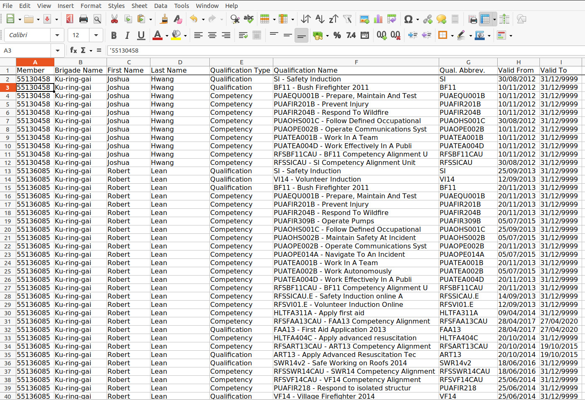
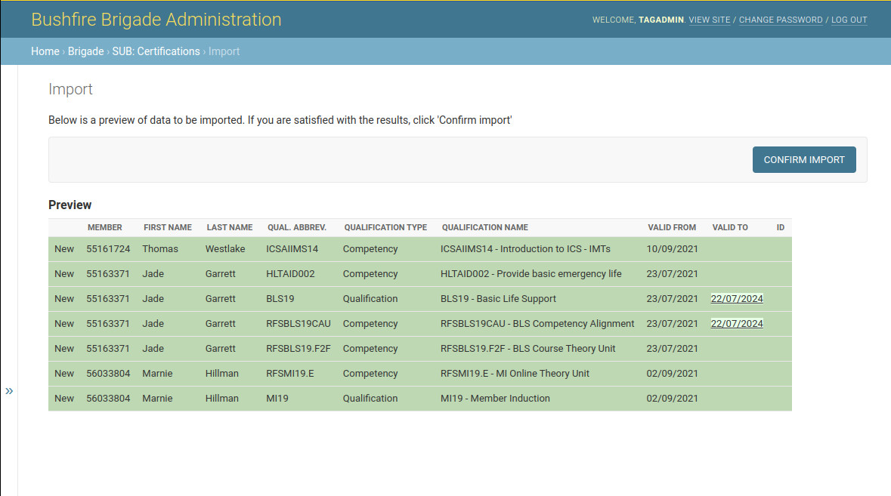
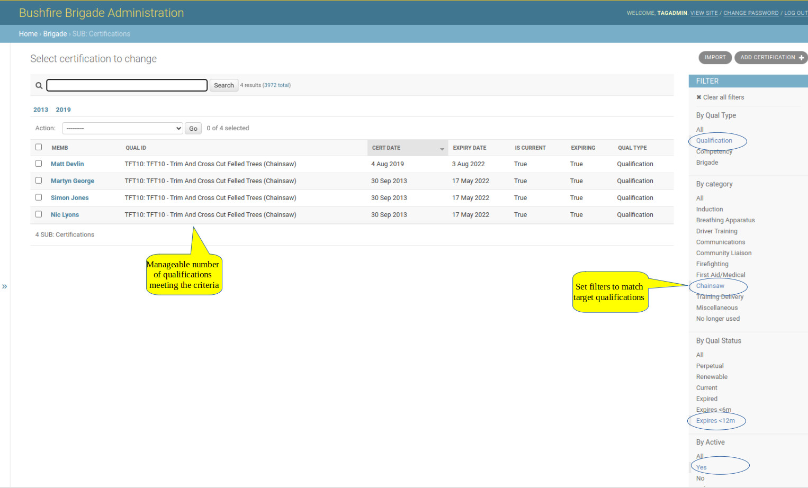

# Administration Procedures (Under construction)

```{margin} Restricted Access
Access to most of the Administration procedures below is restricted to genuine system admins, 
and these are not generally available to Members or Officers.
```

## Preparing and Issuing Tags

### Preparation

* Before you start, make a list of all the new tags you want to prepare, including the member name, and their 
RFS member number

* Get a batch of tags to write. You can overwrite old tags if they are no longer in use

* Bring a marker pen to write the initials of the member on the tag when it is written

### Making Tags

* On the Raspberry Pi kiosk terminal, press the F11 key to show the background

* Open a new command shell by clicking the black icon on the top row of the screen

* Type the command : **writetags**

* The program will prompt you to place a tag on tag reader. When you do, it will prompt you to provide an RFS member number. 
Type this in and hit ENTER. The tag should then be written. 
  
* When you remove the tag, it will prompt you for another one.  Repeat if needed for more tags

* On the last tag, if you press ENTER when prompted for an RFS member number the program will terminate. You can 
  also terminate the program by typing ctrl-c

### Checking the tags

* Reboot the PI by clicking the top left raspberry symbol (top left of page), then choose reboot

* When restarted, add a new event with description “test” and category Social

* Then try to sign in to the new event using the new tags. The members name should appear in the new event, 
with the sign-in time. Tag a second time to sign out

* You can also check the tag using android mobile phones. If you place the tag on the back of the phone, 
it should detect an NFC device. It will show the RFS member number, the date when it was created, 
  and the brigade it belongs to.

(brig-sett)=
##  Brigade specific settings

If you have full admin privileges, under Brigade Settings, you will see your own Brigade. Select that and then you will
see the following fields:

The following settings should be set before the system goes live for your brigade:

Season Start
: This sets the start of the period when member activity is calculated. The end is exactly 
  1 year (365 days, or 366 in a leap year) later. It should normally be set so that the end is just before the next AGM. 
  The same date applies to all seasons, and the year part can be ignored.

Vote Count Hours
: Check this if you want hours to be the default units in the {ref}`Member Activity report<memb-act>`. If not checked, the default 
unit will be Events. It's only a default, and either unit can still be selected in the Member Activity table.

(set-vote-crit)=
Vote threshold hours
: This defines the number of Hours required to be eligible to vote in Brigade Elections. Voting Criteria are normally
defined in the Brigade Constitution, and if Hours are defined there, set this value to match.

Vote margin hours
: If a member is just below the Vote threshold hours, you can set this to show that they are nearly there 
  (coloured yellow in the table). For example, if set to 10, with Voting Threshold at 60, if a member is between 50-60 
  at the end of the season, they will show as yellow, if below 50 they will be red.

Vote threshold events/Vote margin events:
: Same as Vote Threshold Hours, except used where events are the preferred units rather than Hours.

Activity Types
: This sets the list of activities that are available when creating a new event. Choose your selection from the large 
list available. These will then appear in the dropdown box as options for Activity Type when 
a {ref}`new event is created<kiosk-newevent>`.

  This doesn't affect existing events, and they retain their original activity type. 
  
  You can change this setting in future if you want to add other event types.

Excluded activity types
: Any activity types selected here will be excluded from Member Activity calculations for voting eligibility.
  Generally, only Social/Personal are excluded, but this can be changed as needed.
  There is a checkbox on the {ref}`Member Activity Table<memb-act>` labelled *Add Excluded Events*, that will include 
  these events (they are excluded by default). If you drill down into one of the numbers, Excluded events will be shown in 
  grey (normally they are not shown at all).

## Adding a New Brigade

### Data Required from Brigade

The brigade should provide the following details, preferably in an excel spreadsheet:

* All Member Details (preferably from onerfs "Brigade Personnel Response Analysis" report), including
  * Firezone number
  * First Name
  * Last Name
  * Preferred First Name
  * Mobile number
  * Email address
  * Date Joined
  * Date of Birth
  * Active status (yes/no)
  * Member Type (Operational/Reserve/Social/Administration/Support)

* Member Qualifications 
  * Brigade manager to obtain "Qualification Report" from onerfs Team Reports
  * see here for details: [Member Qualifications](https://rfstag-user.netlify.app/administration.html#synchronising-qualifications-with-sap).

* Current Officers (for all Field and Admin positions)
  * Member Name
  * Member FireZone number 
  * Position Title
  
* Brigade Vehicles
  * Full name (eg. Wyee Point 1A)
  * Abbrev name, eg. WP-1A
  * Make, eg. Isuzu
  * Category (eg. 1, 7, 9, ...)
  * Year
  * Crew capacity
  * Aircraft Code
    
* Brigade Settings
  * see {ref}`Brigade Settings section<brig-sett>` above
  * This can be done last, after all of the above

### Hardware Order Parts List

* Raspberry PI
  * PI 4 2Gb RAM
  * PI 4 case
  * Micro HDMI cable
  * PI 4 power supply
  * 16Gb SD RAM card
  
* Tags
  * Sony PaSoRi RC-S380 card reader (USB)
  * 100 x 13.56MHz NTAG215 NFC Key Fob Tags

### Equipment to be Provided by Brigade

* Kiosk
  * Computer monitor with HDMI connection (can be touchscreen if available)
  * USB Mouse (preferably wired)
  * USB Keyboard (preferably wired)
  
* WiFI connection
  * SSID and password  

### Modem Setup for Remote Access

### Adding a New Tenant Schema

### Populating New Tenant Schema

### Brigade Settings

### Testing

### Full Deployment


## Periodic Admin Procedures

### Set Recurring Events in the Calendar

(sync-sap)=
### Synchronising Qualifications with SAP

Member qualifications are issued and managed by the RFS, and are stored in their SAP system. Until recently, there was no 
easy way to download all member qualifications for a brigade from SAP, so if the Sign-In system wanted to refer to 
qualifications, a parallel set of qualification records had to be set up and maintained. 

Training Officers have a lot on their plates, and, not surprisingly, they were not keen on keeping a separate
set of records for member qualifications.

However, now that member qualifications can easily be downloaded from SAP, I have added a new feature that allows RFS 
qualification records to be uploaded to the Sign-In system, so that the qualifications used are up to date and in sync 
with SAP. Once uploaded, they can be refreshed and updated with a new listing taken from SAP whenever required.

(sap-download-permissions)=
:::{admonition} Brigade Manager Permission needed on OneRFS

The Brigade Manager on OneRFS can access details of all qualifications and competencies recorded in SAP for all brigade 
members, using the Member Portal. The Qualification Report can be found under "Team Reports".

:::


:::{figure-md} sap-records
:class: myclass



RFS SAP Qualifications Report Spreadsheet (click to enlarge)
:::

Qualification records are used in the {ref}`Member Qualifications<memb-quals>` view, which allows members to see 
what qualifications are recorded in their name on SAP, and to check that these records are accurate and complete.

SAP records can be uploaded to the Sign-In system from the Admin system, under Brigade-Certifications, using the 
Import button on the top right of the page.

You will then see the following page. Enter the name of the Excel file downloaded from RFS SAP that has 
the full list of brigade qualifications. Select **xlsx** as the format, and then Submit.

:::{figure-md} import-certs
:class: myclass


Importing RFS SAP Qualifications (click to enlarge)
:::


```{margin} SAP files are big!
   These files can be 4000 lines or more, and the system has to check each record to see if it already has it in the 
   database. It can take a little while to load all the brigade qualifications, so please be patient.

```
The system will read each line in the SAP report, and check if it matches an existing qualification in the database. 
If it finds a match, it will skip the record (existing records remain unchanged), and move on to the next one.

After a short delay, the system will show any qualifications from the SAP file which are not already in the system 
database, for review. Click **Confirm Import** to complete the import of the new records. After another short delay, 
your records will be updated.


:::{figure-md} update-certs
:class: myclass



Importing New Qualifications (click to enlarge)
:::

Certifications should be updated every 3 months or so, or whenever there have been significant updates to brigade 
qualification records in SAP.


### Making Training Plans

The system can help with the following aspects of training planning:

**1. Check Basic Qualifications**
   
  The {ref}`Member Qualifications<memb-quals>` view shows qualifications for all active members, and any gaps in 
  basic qualifications such as Induction (VI/SI) and BF, should be clear from that. 

**2. Check Sufficient Numbers of Qualificationss**
   
  The {ref}`Member Qualifications<memb-quals>` view also shows how many members are qualified in specific areas (at 
  the bottom of the page). It should be clear from this if enough members are qualified in specialist areas such as 
  Chainsaw, First Aid, etc. to meet the needs of the Brigade, and if not, unqualified members can be encouraged to 
  take further training.

**3. Check Status of Renewable Qualifications**

  The admin view has some useful filters that can help to locate qualifications that match certain criteria. For example, if 
  we want to find qualifications that are due to expire in the next year (and may have to be renewed), you can set the 
  filters to make a smaller, more managable, list of qualifications that you are interested in.

  For example, the settings below will show only Chainsaw qualifications for active members, that will expire in 
  the next 12 months.

  You can mix and match these filters to home into the set of records you need. When you're done, you can clear all 
  filters get back to the original, unconstrained, view.

:::{figure-md} filter-quals
:class: myclass



Filtering Certifications (click to enlarge)
:::

#### Legacy Certifications

Now that the definitive RFS SAP records (used in ACTIV and other places) can be imported, there is no need to maintain 
a parallel set of qualification records for members. Any reports showing qualifications will reflect the latest data 
imported from SAP, and the SAP records supersede any other records that may have been set up before.

In general, you should not change or add any certification records, except through importing from SAP. If the SAP records 
are incorrect, or some are missing, the priority should be to get them fixed in SAP, rather than fixing them in the 
sign-in system. The corrections will come through next time you import records from SAP.

### Driving Permissions (TD & PD)

Permission to drive Brigade vehicles is given by the Brigade Captain, and records of who can drive which vehicles are
stored as certifications in the sign-in system.

These are not RFS qualifications, and are not recorded in SAP, as they are local to the brigade.

If the Brigade Captain authorises a member to drive the brigade's heavy vehicles, a certification of type **TD** should be 
created and stored in the certification section of the sign-in system admin area. Similarly, members who are permitted 
to drive light vehicles (but not heavy vehicles) should have a **PD** certification recorded in their name.

The **RFD** qualification which goes with this, is issued by the RFS, and is included in the SAP qualifications. The 
{ref}`Member List<memb-list>` shows TD and PD permissions, and these are shown in lower case if RFD is out of date or not 
available for the driver.

### AWS Credits (annual)


## Ad-Hoc Admin Tasks

### Deleting Members

Don't! If you do, you will also delete their attendance records, which is against the law. To stay out of jail, 
check the **Inactive** box next to the Member's name instead.

### Changes to Vehicle Fleet
