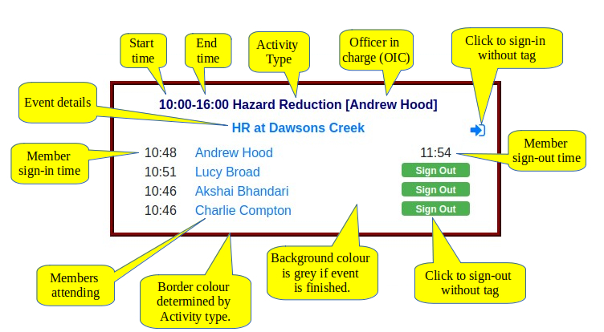

(eventsection)=
# Events

Events are a central part of RFStag. Think of an event as like a page in the old Attendance Book.

When you attend the station, you sign-in to an activity that is occurring at the station, in the same way that 
you signed into an activity on the old Attendance Book.

When you create an Event, you provide the same details as if you were filling in the top of the page in the 
Attendance book, including:

* Date and time of an activity

* Name of the OIC running the activity

* The type of activity (Training, Maintenance, Meeting, etc.) 
  
* A brief description of the activity


When these details have been supplied, you will have a new event that members can sign-in to.


:::{topic} Anatomy of an Event

An event consists of a heading, containing information previously held in the heading of a page in the Attendance Book, 
and a list of attendees, including when they signed-in and signed out.

:::

:::{figure-md} event-anatomy
:class: myclass



Event components, as seen on the Kiosk (click to enlarge)
:::

(change-event)=
Details of an event {ref}`can be updated on the kiosk<change-event>`.

Events can also be changed in other contexts (on the web portal, rather than on the Kiosk), such as the 
{ref}`Brigade Calendar<calendar>`, Upcoming Events, etc. but only if you are logged in as the 
member who is OIC on the event. If you aren't the OIC, you can still see the details of the event, 
but won't be able to change anything.

Apart from updating the event (as above), the following actions or triggers will update an event on the kiosk:

1. Signing in or signing out with a tag.
2. Signing in using the <span class="fa fa-sign-in fa-xl" style="color:blue; font-size:20px;"></span> icon on the top right of the event
3. Signing out using the <span class="sd-badge sd-bg-success sd-pill sd-text-white">**Sign Out**</span> button
4. Clicking a member name to edit their attendance details.
5. When the event becomes open, as the time reaches 1 hour before start time.
6. As the event closes when the end time is passed.
7. Just after midnight, when the "slate is cleaned", and events for the new day are shown.

## Mandatory Event Fields

All events must include the following information:

Date 
: This defines the day on which the activity starts.

```{margin} Extended Operations
Events represent a single shift, and normally start and end on the same day. 
In the case of extended operations running over several days (eg. out of area), details should be recorded 
using one event for each daily shift.
```

Start time 
: The time, on the given Date, when the activity begins. Members may sign in to an event from one hour
  before the given Start time, up to the End time.


End time 
: The time when the activity is expected to finish.  In most cases this will be on the same day as the Start 
  Time, but if an event is expected to {ref}`run overnight<overnight>`, the End Time can be set to a time before the 
  Start Time, which will be interpreted as being in the following day.

```{margin} Changing Events
On the Kiosk, anyone can [change the details of any event](change-event). However, on the web portal, only the OIC is 
allowed to change their own event.
```
Officer in Charge (OIC) 
: Only members who hold a current Officer position may be assigned as OIC. This includes 
  Field Officers and Administrative positions. The OIC will normally attend the event, but they don't have to.

Activity Type 
: Each brigade can define the types of activities that they wish to use, and the system administrator 
  will set these up for the brigade. The activity type for an event should be chosen from the list of available types.

Description 
: A brief description of the activity should be provided for future reference, e.g. "HR at Dawsons Creek".  

   
## Optional Fields

```{margin} Events with no attendees
Events can exist with no attendees, but if they are in the past, this usually serves no purpose, so the empty 
event can be deleted. 
```

Attendees/Crew
: As members sign-in to an event, they are added to the list of attendees, along with the times they 
  joined and left the activity. Any active member can sign-in to an event, and the number of attendees is only 
  limited by the number of active members in the brigade. 
 
```{admonition} Members can only attend an event **once**
:class: tip
When a member signs in to an event, they can sign-out later, but won't be able 
to sign-in again to the same event. This allows members to use their tag to sign-in first, tag again to sign-out, then 
tag again to sign-in to another event. If necessary, a long-running event should be broken down into smaller parts 
if there are breaks or other activities in between.
```

(ev-veh)=
Vehicles 
: If brigade vehicles are used in an event, this can be noted in the event. This is useful in tracking
  {ref}`vehicle availability<vehbook>` when events are planned in advance. 
   

## Event Types

:::{figure-md} full-kiosk
:class: myclass


Busy Kiosk screen (click to enlarge)
:::


Events come in the following types (see above for examples):

### Basic Types 

**Open/available** (white background, solid border)
: Events become open 1 hour before their start time and remain open until their end time. When they are open, 
  they will accept sign-ins from members either using a tag, or using the sign-in icon.

**Closed/completed** (grey background, solid border)
: Events close when their finish time has passed. They will not accept sign-in attempts with a tag. The sign-in icon 
  will also be removed.
   
**Future** (white background, dashed border)
: Events starting more than 1 hour in the future will not be available to sign-in with a tag, and no sign-in icon is shown.

### Additional Types

(overnight)=
**Overnight**
: Normally, events are removed from the kiosk at midnight when the display is updated. However, you can specify
  that an event runs overnight by giving a finish time in the next day. 

  The kiosk shows all events that start **or end** on the current day, so an overnight event will appear on both 
  the start day **and** on the end day. This allows crew to sign out when they return from a night shift.

:::{admonition} **Always set the end time for overnight events**
:class: warning
Since events are always less than 24 hours in duration, in overnight events the end time must be less than the 
start time, e.g. Start: 18:00, End: 06:00.

If the OIC doesn't set the end time of an event so that it ends the next day, members won't be able to sign-out
when they return from their shift, as the event will have been wiped from the kiosk at midnight.

If there's any chance you might be out past midnight (like Cinderella), make sure you set the end time past midnight. 
If you get back early, no problem.

:::

(externalevents)=
**External**
: If an event is being run at another location, rather than at the station, attendance can still be recorded in the 
  system.

  Members who are known to be attending this event should be added to the event by the OIC ahead 
  of time. If they arrive at the station to travel to the event (e.g. at a training centre), they can sign-in as normal.
   
  Any member not on the preset list will not be offered the option of signing in to external events when they tag in. 
  External events normally run for a full day, and if the attendees are known up front, there is no point asking 
  other members not on the list whether they want to attend such events.

  For convenience, and since members will not normally sign-in or sign-out at the station, sign-in and sign-out times
  are initialised to the event start and end time respectively. These can be changed as needed. Any members listed
  in the event in advance may still sign-in at the station, and that time will be recorded instead of the event start 
  time.

  External events should be used for any activity which takes place away from the station, and so most attendees won't
  sign-in at the station (eg. video-conferences, Out of Area Strike Team shifts, Offsite Training courses, etc.)
  This avoids {ref}`overlaps<overlappingevents>` with other activities at the station - anyone not in the preset list 
  of attendees for an external event will not be asked if they want to attend the external event if there is an 
  overlap in times, so it makes signing in a little easier for most members.

(pagercalls)=
**Pager Calls**
: Pager Calls are detected by a separate system which automagically creates a new event on the web server 
  as soon as a callout is received for your brigade.

  The event should be available for members to sign-in to when they arrive at the station.

  The event title will be the same as the pager message. The format of this message will vary by district, but 
  generally it includes the name of the paged brigade, the type of call, and the CAD number. 

  The actual OIC is not known when the pager call arrives, so the system assigns the call-out officer or the SDC
  as the OIC by default. This should be {ref}`updated<change-event>` by the actual OIC when the crew returns 
  to station.

:::{figure-md} pager-callout
:class: myclass


Pager callout event (click to enlarge)
:::

(colour-coding)=
## Colour Codes

The border around events is colour coded depending on the activity type, as follows:

```{div} training
* **Training**
```
```{div} incidents
* **Incidents (including Pager Calls)**
```
```{div} hazardreduction
* **Hazard Reduction**
```
```{div} communityengagement
* **Community Engagement**
```
```{div} maintenance
* **Maintenance**
```
```{div} meetings
* **Meetings**
```
```{div} other
* **Other**
```


