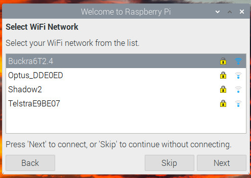

# Internal Procedures (Under construction)

```{margin} Restricted Access
For internal use only
```

## Adding a New Brigade

### Data Required from Brigade

The brigade should provide the following details, preferably in an Excel spreadsheet:

* All Member Details (preferably from onerfs "Brigade Personnel Response Analysis" report), including
  * Firezone number
  * First Name
  * Last Name
  * Preferred First Name
  * Mobile number
  * Email address
  * Date Joined
  * Date of Birth
  * Active status (yes/no)
  * Member Type (Operational/Reserve/Social/Administration/Support)

* Member Qualifications 
  * Brigade manager to obtain "Qualification Report" from onerfs Team Reports
  * see here for details: [Member Qualifications](https://rfstag-user.netlify.app/administration.html#synchronising-qualifications-with-sap).

* Current Officers (for all Field and Admin positions)
  * Member Name
  * Member FireZone number 
  * Position Title
  
* Brigade Vehicles
  * Full name (e.g. Wyee Point 1A)
  * Abbrev name, eg. WP-1A
  * Make, eg. Isuzu
  * Category (eg. 1, 7, 9, ...)
  * Year
  * Crew capacity
  * Aircraft Code
    
* Brigade Settings
  * see {ref}`Brigade Settings section<brig-sett>` above
  * This can be done last, after all of the above

### Hardware Order Parts List

* Raspberry PI
  * PI 4 2Gb RAM
  * PI 4 case
  * Micro HDMI cable
  * PI 4 power supply
  * 16Gb SD RAM card
  
* Tags
  * Sony PaSoRi RC-S380 card reader (USB)
  * 100 x 13.56MHz NTAG215 NFC Key Fob Tags

### Equipment to be Provided by Brigade

* Kiosk
  * Computer monitor with HDMI connection (can be touchscreen if available)
  * USB Mouse (preferably wired)
  * USB Keyboard (preferably wired)
  
* Wi-Fi connection
  * SSID and password  


### Adding a New Tenant Schema

Optional steps (when building schema on tst system) shown in <span class="opt">italics</span>.

* Make backups of any target databases using pgadmin
  * Make backup of AWS production database (ebdb) on dev system using pgadmin
    * Set inbound rule on RDS security group for MyIP if needed
  * <span class="opt">Drop AWS tst system database (ebdb) to clear contents</span>
  * <span class="opt">Restore backup of AWS production database to AWS tst database</span>

* In pycharm project bushfire2: 
  * In bushfire/settings/.env set RDS_HOSTNAME=<span class="opt">bushfire2-tst6-rds.c5b4rv0axnji.ap-southeast-2.rds.amazonaws.com</span>
  * Check all migrations in all apps saved in github  
  * Add new tenant name to settings.base.CUSTOMER_LIST
  * Run/Edit Configurations
     * Env vars: PYTHONUNBUFFERED=1;DJANGO_SETTINGS_MODULE=bushfire.settings.local
     * Working directory: ~/PycharmProjects/bushfire2
     * Script path: /home/ian/PycharmProjects/bushfire2/manage.py
        * createBrigade Parameters: 
          * python manage.py createBrigade <span class="opt">Cambewarra</span> --short <span class="opt">CBW</span> --host <span class="opt">rfstag.com</span>
     * Run createBrigade in a Python runtime environment
  * In Terminal window (note that arguments don't appear to work on command line): 
       * (bushfire2) ian@ian-ThinkPad-T490:~/PycharmProjects/bushfire2$ python manage.py create_tenant_superuser 
       * Enter Tenant Schema ('?' to list schemas): <span class="opt">cambewarra</span> 
       * Username (leave blank to use 'ian'): admin
       * Email address: ibowditch@gmail.com
       * Password: 
       * Password (again): 
       * Superuser created successfully.
  * Set Run/Edit Configurations for setupBrigade as for createBrigade  
     * Parameters: python manage.py setupBrigade <span class="opt">Cambewarra</span>
     * Run setupBrigade environment
  * Set Run/Edit Configurations for set_tenant_domains
     * IMPORTANT!!!
     * Parameters: python manage.py set_tenant_domains
     * Run set_tenant_domains environment
    
* Login to admin into the new tenant using admin user
*   Change tenant name to readable version, eg. Gosford Bulk (with space) using signin.org
  *    * **NOW RESTART APPLICATION SERVER**
      * All might look ok, but probably isn't
      * Need to clear caches to rds (?)
      * If don't restart, often get weird, scary, server crashes about 36h after adding new tenant

* Login to admin into the new tenant using admin user
  * Check passwords for utility users kiosk, tagadmin, pager are set, and if not set to correct values
  * Import Members from provided list
    * Check that all members have unique email addresses
  * Set up Officers for previous year with provided details (once set up in dev, export for use in AWS updates)
    * Check Groups assigned properly (esp. Training, Personnel)
    * Try to get order of DCs (not included in onerfs report)
  * Set Brigade Details
    * All activity types are valid: deselect External and any others
    * Check social as excluded
    * Set season start date (ignore year)
    * Set activity types
    * Set excluded activities
    * Check and update location, phone number, etc.
    * Add pager capcode and region
  * Add tenant name to relevant entry in kbfb/media/public/capcodes.csv (may be deprecated at some point)
  * Import qualifications from RFS list under admin certifications/import
  * Add TD/PD certifications for nominated drivers (manually)
    * Not always clear from either Licences or Administration reports
    * Assume initially that >=MR licence is TD, and anyone with RFD but <MR is PD
  
* Test logins
  * tagadmin, kiosk, pager
  * Also try one user, with rfsID as password (should prompt to change password)

* Kiosk setup
  * Make server visible on network
    * On kiosk, add signin.org to /etc/hosts
    * On dev system, run on 0.0.0.0, not 1.0.0.127
    * On aws, add redirect for wyeept.rfstag.org and wyeept.rfstag.com (shouldn't be necessary)
  
* Test remote.it
  * If possible, connect PI to external network (eg. SHADOW)
  * In [remote.it console](https://app.remote.it/#/devices) confirm that device is online, and click VNC to connect with it
  * Copy address from connection details (eg. proxy65.rt3.io:37011) and add a connection in VNC viewer with this address.
  * Connect using VNC viewer to confirm connection ok.
 
* Restart pager server
  * Confirm new brigade registered (check journalctl -b | grep page)

(pi-setup)=
### Setting Up a New Kiosk Raspberry PI

Boot the PI with the NOOBS SD-CARD, and follow the generic instructions in the 
[Official documentation](https://www.raspberrypi.com/documentation/computers/getting-started.html#configuration-on-first-boot).

Use the following settings where required:

:::{figure-md} pi-country
:class: myclass


PI country settings (click to enlarge)
:::

Password set to this by convention (but can be changed if needed):

:::{figure-md} pi-password
:class: myclass


PI password (click to enlarge)
:::

Network connections normally via station wifi, but can be hard-wired too. Provide the wifi password, and 
it will be remembered for next time.

:::{figure-md} pi-network
:class: myclass



PI network (click to enlarge)
:::

Update software - don't skip this step, but it will take a while.

Configuration settings 

In system settings tab, make sure Wait for Network is checked, and change Hostname to the same 
name as brigade

:::{figure-md} pi-settings1
:class: myclass


PI System configuration (click to enlarge)
:::

In Interface settings tab, Enable SSH and VNC to allow remote support:

:::{figure-md} pi-settings2
:class: myclass


PI interface configuration (click to enlarge)
:::

**Final checks**
* Configuration/Display: screen blanking disabled (enabled by default!)
  * May be redundant: launch_kiosk turns off screen blanking as well
* */boot/config.txt* : Comment out #dtoverlay=vc4-fkms-v3d (maybe multiple places)


Reboot after changing PI configuration when prompted.

### Installing the Kiosk Software (apt procedure)

Kiosk software is now delivered as a package using the APT tool. The package replaces most of the original 
installation procedure, and includes the following components:

- nfcreader program, for reading and writing tags (writetags)
- systemd services to launch the kiosk in a browser (launch_kiosk2) and start the nfcreader (nfcserver2)
- Configuration files for nfcreader and tag reader (udev)
- Unattended upgrades and schedules for automatic updating
- journal set up to maintain long term record

#### Initial Preparation

- Preserve then remove the original installation if needed:
  - Copy file nfcmanifest2 to the new PI using scp
    - scp ~/PycharmProjects/nfcserver/nfcreader/nfcmanifest2 pi@192.168.0.101://home/pi
  - Save original installation if needed (this leaves files in place)
    - sudo tar -czvf oldnfc.tar.gz `cat nfcmanifest2`
    - tar -tvf oldnfc.tar.zip   				# to confirm
  - Remove original installation
    - cat nfcmanifest2 | sudo xargs rm -rf

- Confirm that the PI hostname is set to the brigade/tenant name and change if needed

- Set up access to remote.it (!! Make sure quotes are right if doing copy/paste !!!)
  - REMOTE_IT_CODE="D95F00F0-3DDC-5535-9D47-CF7BBFD8C5A4"
  - ! [ -d /etc/remoteit ] && R3_REGISTRATION_CODE=$REMOTE_IT_CODE sh -c "$(curl -L https://downloads.remote.it/remoteit/install_agent.sh)"


#### Add the rfstag-kiosk repository (one-off procedure)

* Add the public security key so access is granted:

  - curl -s --compressed "https://ibowditch.github.io/rfstag-kiosk/KEY.gpg" | gpg --dearmor | sudo tee /etc/apt/trusted.gpg.d/rfstag.gpg >/dev/null

* Add the rfstag-kiosk repository to the list of available sources:

  - sudo curl -s --compressed -o /etc/apt/sources.list.d/rfstag.list "https://ibowditch.github.io/rfstag-kiosk/rfstag.list"
  - sudo apt update
  - reboot

#### PI display problems and VNC connections

Very tricky. Best to copy a working config.txt to the new machine.

If get VNC saying connection not ready, shutdown with monitor connected, then disconnect monitor and restart
While standing on left leg. See notes from 230413 and weep.
 


#### First installation

Installation is now just:

- sudo apt update
- sudo apt -y full-upgrade        # to get system up to date
- **sudo apt install nfcserver2**
- reboot (not strictly needed but just to be sure)

Notes:

1. By default, the package will use the hostname of the PI as the brigade/tenant name, so make sure that is set correctly before installing the package.
2. If successful, a browser will start on the kiosk page for the given brigade. Sign in, and save the password.
3. In the background, the nfcreader program should also have been launched, and after creating a new event, tags for the brigade should work correctly.
4. After the first installation, the package will be automatically updated by unattended-upgrades in the middle of the night.


Post-install checks

1. Check sound is configured correctly and operates as expected
2. Check access to remote.it works as expected using the remote.it phone app.
3. Check tag reader operates correctly. Use **journalctl -b | grep nfc** to review logger messages. 
4. Check services are up and running:
   - systemctl status launch_kiosk2
   - systemctl status nfcreader2
5. Check that nfc reader can be plugged into other USB ports. The nfcserver2 service should stop when disconnected, and restart automatically whne reconnected. Check the journal for required behavior. This is controlled by file **/etc/udev/rules.d/90-nfcdev.rules**


Further configuration

Basic configuration is controlled by the file **/etc/profile.d/rfstag/base.env**. This should be sufficient in 
most cases.

These settings can be overriden if needed, by copying **/home/pi/.config/rfstag/local-example.env** to local.env in the same
directory, then editing local.env as needed.

This can be used to do the following:

- Change KIOSK_BRIGADE if the hostname is not the brigade name (eg. multiple kiosks)
- Change KIOSK_LOCATION to a second kiosk name
- Change BUSHFIRE_SERVER to use a test system, eg. rfstag.org, rather than the production server.


### Building the nfcserver2 package

ref: https://earthly.dev/blog/creating-and-hosting-your-own-deb-packages-and-apt-repo/

See /home/ian/PycharmProjects/nfcserver2 for source code. Note that settings from **/etc/apt/apt.conf.d/rfstag.conf** are used when building the package.

Key areas:

- debian
  - contains configuration files for the package, the most significant of which are:
    - changelog: needs to be updated with every release. Can be done manually or using dch
    - install: lists all files included in the package, and where they need to go on the target machine
    - pre/postinst: pre and post installation procedures
    - rules: basic makefile template
- conf
  - Include configuration files for
    - APT (02periodic, 51unattended-upgrades)
    - udev (90-nfcdev.rules) to launch service when nfc device connected
    - base/local.env: rfstag kiosk configuration
    - msmtprc: email server configuration
- src
  - top level scripts, installed in /usr/bin, some called from service file
- systemd
  - launch_kiosk2.service
    - starts a browser at the kiosk page for the brigade
    - Depends on network, and will restart if fails
  - nfserver2.service
    - Runs tag reader in background
    - Launched on startup
    - Stopped if reader disconnected, restarted when reconnected
    - Requires alsa sound system to function for beeps (might not be ready first time on restart, but will retry).

A new deb file is built using the **buildeb** script. It is named after the version number, 
eg. nfcserver2_1.42.0_all.deb, and is placed in the ~/PycharmProjects directory.

The deb file can be tested by scp'ing to a test PI, then **sudo apt install /home/pi/nfcserver2_1.42.0_all.deb**

NB: .deb filename must be spelled out in full - no wildcards. 

ref: https://assafmo.github.io/2019/05/02/ppa-repo-hosted-on-github.html

Once it is ok, it can be placed on the github repository as follows:

- cd ~/rfstag-kiosk
- cp ~/Pyc*/*42*.deb .
- ./rebuild

This will send the new .deb file to the github repository, and it will be available for download by clients after a few minutes.

rfstag kiosks are set to check for updates each night, and unattended-upgrades will automatically download and install kiosk updates.


### On screen keyboard

Normally, a USB keyboard and mouse are connected to the Raspberry PI to allow normal interaction with the Kiosk.

If required, the USB keyboard can be replaced with an on-screen keyboard, similar to those used on mobile phones.

There are several options available: see [3 options](https://www.industrialshields.com/blog/raspberry-pi-for-industry-26/post/top-3-on-screen-virtual-keyboards-for-raspberry-plc-panel-pc-401) here.

[onboard](https://manpages.ubuntu.com/manpages/bionic/man1/onboard.1.html) has been tested and used by one brigade.

To make sure the keyboard is visible while running the kiosk:

* echo "SCREEN_KEYBOARD=/usr/bin/onboard" >> ~/.config/rfstag/local.env

Should be able to replace **onboard** with any other keyboard in the above, but not tested.

#### Running the ACTIV dashboard on the PI

The latest Raspberry PI 4B has 2 HDMI sockets, so a second screen can be attached. If needed, this can be used
to display the ACTIV dashboard, as well as run the normal sign-in Kiosk.

Will need a second HDMI cable with micro-HDMI connection: get from [Core Electronics](https://core-electronics.com.au/raspberry-pi-micro-hdmi-to-standard-hdmi-1m-cable.html).

With a second monitor attached, type **launch_activ** on a command line.

Files:

* /etc/profile.d/rfstag/base.env
  * Offset of second screen set with HDMI2_X_OFFSET=1920
  * Overwrite in /home/pi/.config/rfstag/local.env if needed
  * Depends on resolution of the first monitor. 
* /usr/bin/launch_activ 
  * Uses default of 1920 if HDMI2_X_OFFSET not set.
  * sudo systemctl start 
* /lib/systemd/system/launch_activ 
  * sudo systemctl start launch_activ to set ok
  * enable if ok, so starts at reboot
* /home/pi/Documents/Profiles/1
  * Need to define a second profile for the second screen, separate from kiosk
  * set this in env file: ACTIV_CHROME_PROFILE=/home/pi/Documents/Profiles/1
* Launch page will initially require login
  * Use brigades dashboard login and password
  * Remember credentials


230412: As of this date, the second ACTIV screen config has some problems.

It works, but there are lots of warnings and errors logged in the journal, probably related to having 2 independent 
chromium browsers running in parallel.
launch_kiosk2 files have been updated to remove ACTIV and a seocnd screen until this is fixed properly.
ACTIV support has not been released, and is not generally available at present, and it should stay that way until
further investigations are completed.
NB: Further journal messages are still being generated unless dtoverlay=vc4-fkms-v3d is commented out of /boot/config.txt.
This file can't be included in the APT package, so will require a manual check on each kiosk to ensure it is disabled.
These messages seem benign, but better to remove source if possible.


### Installing the Kiosk Software (original procedure)

Copy the installation package from a thumb drive into folder /home/pi, or use (in tpad shell, not pycharm):

* cd /home/ian/PycharmProjects/nfcserver
* makeself --notemp nfcreader nfcreader220920f.sh bushfire ./nfcinstall 

* scp /home/ian/PycharmProjects/nfcserver/nfcreader220920f.sh pi@192.168.0.226://home/pi

Open a command Terminal (top menu bar - black box). 

Run the installation procedure as follows:

  ./nfcreader220920f.sh

This can take some time, as it will update the system software.

The installation procedure will do the following:

* Set the Brigade the kiosk will use (when prompted)
  * A server of this name must exist, or the given name will not be accepted.
  * The nfcreader.ini file will be updated with the given validated Brigade name.
* Install sound files (for beeps and buzzes)
* Install python libraries for sound and nfc support.
* Remove unwanted, large packages to free disk space (e.g. libreoffice, games, wolfram,... )
* Add kiosk software to /usr/local/bin
* Set boot script in /home/pi/.config/lxsession/LXDE-pi/autostart
* Register the Sony nfc reader
* Register and start the nfcserver service, used to read nfc tags.
* Set up unattended upgrades to keep the system up to date automatically.
* Set up remote.it to enable remote support

Then reboot when finished.

Then test nfc using:

   python3 -m nfc

If there's an error (likely), you'll need to type the following commands to clear the error, then reboot again:

   sh -c 'echo SUBSYSTEM==\"usb\", ACTION==\"add\", ATTRS{idVendor}==\"054c\", ATTRS{idProduct}==\"06c3\", GROUP=\"plugdev\" >> /etc/udev/rules.d/nfcdev.rules'
   udevadm control -R


### First login

If all is set up correctly, the first screen shown after reboot should be as follows. Login using 
kiosk user.

:::{figure-md} pi-firstlogin
:class: myclass


PI first login (click to enlarge)
:::

You will be prompted to Save Password - click Save to do this (IMPORTANT).

### Check remote.it

* Go to https://app.remote.it/#/devices
  * Login as ibowditch on google acocunt
* Check new device is listed in available devices
  * NB: Only 5 available under free account. Will need paid account if need to exceed this
* Connect to new device by clicking on  device, then VNC under Service on LHS
  * Once connected, copy url and make new VNC connections on realVNC
  * Connect with this and check access is ok


### Testing

### Full Deployment to PRD

* Update Platform to latest version in AWS console
  * Do this on test env first to ensure nothing breaks
      * If OK, also do on PRD, indepndent of code changes
  * Don't mix OS upgrade with code changes
  * Hard to undo this, and if fails, difficult to fall back
    * Set OS back to original level in AWS console, and wait for recovery
  * Check main site deployed ok and works with new Platform before proceeding
  
* Check AWS Health checks: Load Balancer Configuration
  Name		  Port	Protocol	HTTP code	Health check path	Stickiness
  default 	  80	HTTP		200		    /indexawsmt		    disabled
  http 		  80	HTTP		200		    /indexawsmthttps	disabled
  websocket 5000	HTTP		200		    /indexawsmtws	    enabled

* Double check all changes since last prd deployment
  * Get last deployment datetime from Running Version, at 
  https://ap-southeast-2.console.aws.amazon.com/elasticbeanstalk/home?region=ap-southeast-2#/environment/dashboard?applicationName=bushfire2&environmentId=e-mccptfvpnq

* Make backups
  * AWS configurations for both tst6 and prd (AWS Console: Actions/Save Configuration)
  * RDS in pgadmin for tst6 and prd: connect to AWS RDS from dev system
  * Snapshot for RDS for tst6 and prd: 
    * See https://ap-southeast-2.console.aws.amazon.com/rds/home?region=ap-southeast-2#databases:
    * Actions/Take Snapshot
  
* Set .ebextensions/02_python.config for PRD, 
  * Comment out # Test settings: bushfire2-tst6
  * Uncomment:  
  * Production settings: bushfire2-prd
    * "SECRET_KEY":  ".................."
    * "RDS_HOSTNAME": "bushfire2-prd-rds2.c5b4rv0axnji.ap-southeast-2.rds.amazonaws.com"
    * "REDIS_SERVER": "bushfire2-prd.pgfstu.0001.apse2.cache.amazonaws.com"
    * "AWS_STORAGE_BUCKET_NAME": "bushfire2-prd"
    * "AWS_ACCESS_KEY_ID": ".............."
    * "AWS_SECRET_ACCESS_KEY": "................"

* Deploy from pycharm terminal:
  * eb deploy bushfire2-prd --timeout 30
  
* Check server logs and emails for any signs of failure
  * New migrations might cause some messages while in transition, but check errors carefully in case


## Create new Elasticache on AWS

* Start at https://ap-southeast-2.console.aws.amazon.com/elasticache/home?region=ap-southeast-2#/redis
* Configure and Create New cluster
* Cluster Mode: Disabled
* Provide cluster name
* Location: AWS Cloud
* Node type: cache.t2.micro
* Port:  6379 (default)
* Replicas: 0 (switches off Multi-AZ)
* Subnet group: bushfire2-prd-ec-sng (vpc-f4221493)
* Encryption: Off
* Security group: sg-bbc0cbc4 (default)
* Backup enabled - 1 Day
* No logs
* Shards: shows 1 for latest redis (6.2.6), 0 otherwise, even if Cluster Mode==Off

* Add to 02_python.conf in deployment settings


## RDS

### Copy prd RDS to dev env

* Check access available to AWS RDS
  * Select RDS DB instance from https://ap-southeast-2.console.aws.amazon.com/rds/home?region=ap-southeast-2#databases:
  * Select VPC Security Group : normally default (sg-bbc0cbc4)
  * Click Edit Inbound Rules
    * Update inbound rule for buckraYYMMDD
    * Click Source=Custom, and select My IP - this will update home IP if changed.
* Open pgadmin on dev machine
  * Make backup of current prd RDS on AWS
    * Select and open AWS prd server - currently bushfire2-prd2-rds2
    * Right click Database ebdb and select Backup
    * Provide filename for backup - eg. /home/ian/kbfb/aws-backups/bushfire2-prd-rds-220916
      * Format=Custom
      * Role Name=ian
    * Click Backup
  * Restore AWS prd backup to local database
    * Make new database under server Thinkpad (dev machine), named eg. bushfire2-prd-220916
    * Right click new local RDS and then Restore
      * Provide name of AWS prd backup file
* Prepare for use in dev env
  * Run management command to localise local RDS to dev env (not really necessary)
    * python manage.py set_tenant_domains
    * NB: This only really necessary for prd or tst environments on AWS
      * Local dev env should still be listed as a valid domain, even if not Primary
  * Point dev env to new RDS 
    * Edit bushfire/settings/.env
    * Set RDS_DB_NAME=bushfire2-prd2-220916  (for example)
  * Run local app and confirm latest RDS in use

### Updating Models/Migrations

- On dev system, run the following in a Pycharm terminal:

    * python manage.py makemigrations
    * python manage.py migrate_schemas

- Then check for any new files under migrations folder in each module, and add them to git.

- Next deployment will run migrate_schemas, and will include the changes providing the new migrations file is in git.
  
## AWS Credits (annual)

For Ku-ring-gai:

* Login to https://www.connectingup.org/ as user admin@kbfb.org.au (use saved password)
* Search for AWS
* Order the Amazon Web Services Credits for Nonprofits - was $136 + GST
* Complete order and pay with own card

Then redeem credits on AWS Credits page:
  * https://us-east-1.console.aws.amazon.com/billing/home?region=ap-southeast-2#/credits
  * logging in with account:
    * Account Id: 373346640794 
    * Seller: Amazon Web Services Australia Pty Ltd 
    * Account Name: Ku-ring-gai Bush Fire Brigade 
    * Password: *****

## Updating userdocs

* Make any necessary updates and check ok on local version http://127.0.0.1:5500/index.html
  * First do make clean html

* Save any changes into git using Commit on top level userdocs directory
  * Do NOT Commit and Push until next steps are completed
  
* Remove Internal section by editing this line in conf.py
  * Use this to keep internal documentation private. Comment out for local use.
  *   exclude_patterns += ['internal*']
  
* Check Internal section not visible on dev machine

* Save in Git
  * ghp-import -n -p -f _build/html
    * NB: will need latest GIT token as password: see https://github.com/settings/tokens

* Commit and Push whole thing
  * This will update both git version at https://ibowditch.github.io/userdocs
    and reference version at https://rfstag-user.netlify.app/index.html


## Adding a New Pager Sub-system

Pager messages are monitored using a Raspberry PI, with an RTL-SDR (Software Defined Radio) USB dongle
set to receive messages broadcast on the RFS Pager frequency (see <https://www.rtl-sdr.com/rtl-sdr-tutorial-pocsag-pager-decoding/>.

Received messages are checked, and if one contains an Incident Call for a customer of rfstag, the pager sub-system 
will send a request to the rfstag server to create a new event for the brigade, so that responding members can
sign-in immediately without having to first create a new event.

The new event has the pager message as the title, the activity type as Incident-Fire, and the OIC as the callout 
Officer or SDC. The event start time is the time of the pager call, and the end time is 3 hours later.

Pager message transmissions are strong, but a single receiver can't cover all of NSW, so additional 
listening stations are needed if a brigade's pager signals can not be received in Sydney.

These instructions show how to set up an additional pager listening station in another region.

* Obtain and set up a Raspberry PI 3B in the  {ref}`same way as for a kiosk<pi-setup>`

* Obtain an RTL-SDR and setup according to supplier instructions, 
  with a dipole antenna. see <https://secomms.com.au/product/rtl-sdr-r820t2-rtl2832u-software-defined-radio-dipole-antenna-kit/>
  * No need to install software or dependencies, just get the hardware set up.
  * Setup the dipole antenna to roughly 1m span, vertically aligned.

* If necessary, generate a self-extracting installation script for the latest pager software 
  by running the following command in a linux shell:
    * **cd ~/Pycharmprojects/nfcserver**
    * **makeself --notemp ./pager pager220928.sh fred ./pagerinstall**
  
* Copy the self-extracting installation script to the target PI:
    * **scp pager2220928.sh pi@192.168.0.59://home/pi**
  
* VNC or ssh to the target pi, and run the self-extracting installer in a linux shell:
    * **./pager220928.sh**
  
* This will do the following:
  * Create a new working directory ~/pager
  * Backup existing files using the **pagermanifest** file as a guide
  * Copy the pager.ini file to ~
  * Install the necessary SDR software using **sdrinstall.sh**
      * Install all dependencies, and then download and build the following:
        * **rtl_fm** 
          * Used to tune the RTL-SDR dongle, and receive messages on the RFS pager frequency
        * **multimon-ng**
            * Used to decode messages from rtl_fm into text 
            * page_to_journal.sh then passes these on to page_to_journal
      * Copy these programs to /usr/local/bin for general use
      
  * Install all python modules, using **requirements.txt** as a guide
  * Remove large, unnecessary apps (wolfram, office, games, etc.)
  * Copy main scripts into place at /usr/local/bin:
    * **page_to_journal**.[py,sh] 
        * Logs all received pager messages to system journal
    * **pager_relay**.[py,sh] 
        * Forwards messages to pushover, compressing adjacent identical messages, using cc:
        * Creates incidents on rfstag when needed for rfstag customers.
  * Installs system services in **/lib/systemd/system** 
      * Main scripts are then launched on system startup
  * Installs automated **unattended-upgrades** and email notification using **msmtp**
  * Installs **remote.it** client to allow remote access
  
* Reboot, and run the following checks:
  * Check main scripts are running correctly:
    * **sudo systemctl status page_to_journal**
    * **sudo systemctl status pager_relay**
  * Monitor system journal for pager messages with:
    * **journalctl -f | grep page**
    * This will show pager messages as they are received
  
* Important pager.ini settings
  * BUSHFIRE_SERVER = rfstag.com
  * PAGER_REGION = sydney
  
* Operational Notes
  * Capcodes are downloaded from the rfstag server using public url rfstag.com/capcodes
  * Brigades using rfstag in this PAGER_REGION are downloaded using public url rfstag.com/brigades/{PAGER_REGION} 
  * Automated updates are available (not yet fully implemented) using public url rfstag.com/update/pager


## PI won't boot

If nothing is shown on the screen, and the PI LED is solid red, it's likely that the SD card is corrupted. This 
prevents the PI from booting up, as it can't read the operating system from the SD card.

SD card corruption can be caused by wear and tear, extensive long term usage (read/writes), or by incorrect
shutdown procedures. Always shutdown the PI properly (ctrl-alt-del, then shutdown) rather than just powering off.

To replace the SD card, you need to:

1. Purchase a new SD card

- 32Gb recommended
- Recommended models at https://www.tomshardware.com/best-picks/raspberry-pi-microsd-cards
- Recommended to buy pre-loaded SD card: 32GB MicroSD Card with NOOBS for all Raspberry Pi Boards
see https://core-electronics.com.au/32gb-microsd-card-with-noobs-for-all-raspberry-pi-boards.html?gclid=CjwKCAiAk--dBhABEiwAchIwkeJNDdNBnoeqsqydU7FNzhWiyUOdbMh0WV1al7JQ1KDvvGrV-bEEfhoCt9kQAvD_BwE
- 
2. Image

For a raw card, follow the procedure at https://www.raspberrypi.com/software/ to load the new SD card with the
Raspberry O/S.

3. Now set up the PI from scratch using the procedure above.

