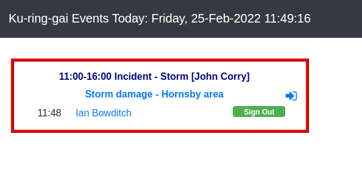

# The Kiosk

## What is the Kiosk?

The Kiosk is a small computer and screen, with a tag reader attached, that replaces the old Attendance Book, 
and records attendance in electronic form. It is normally located at the front desk of the station. 

It is always-on and available 24h every day. It requires an internet connection (wifi or wired) 
to function.

The Kiosk screen shows events that start **or end** on the current day, and is automatically 
updated every night, just after midnight, to show events for the new day.

NFC tags (keyfobs) are issued to all members, and these can can be used to sign-in and sign-out 
of events shown on the kiosk screen.
 

## Basic Operations

(easyway)=
### Signing in - The Easy Way

The Kiosk is designed to make it as quick and easy as possible for members to sign-in and 
sign-out of activities at the station.

In general, the OIC who has organised an activity should set up an event in advance, and when you get to the station, 
you will see something like this on the kiosk screen:

:::{figure-md} kiosk1event
:class: myclass

Kiosk screen with 1 event
:::

If the screen is blank or no events are available, jump to {ref}`blank_kiosk`.

If the event you need is on the screen, all you have to do it to place your tag on the reader, 
and you will be signed in. 

You should then hear a beep as the tag is registered, and the screen will be updated as follows, with your name in 
the event, and the time you signed in.

:::{figure-md} kiosk1event1att
:class: myclass

Signed in!
:::

When you've finished, place your tag on the reader to sign-out. That's it!

:::{admonition} Why you should always sign-in with your tag
:name: usetag

Your tag is unique to you, and essentially replaces your signature in the electronic attendance 
records. Using your tag removes any doubt that it was you who signed-in, so it should be used whenever possible.

There is a mechanism which allows {ref}`notag` but this should only be used in exceptional cases, as the Kiosk 
is a shared computer, and doesn't know who is at the keyboard. 

The system records when a tag is used, and if your brigade is strict about using tags, 
your administrator may remind you to use your tag if they see you are repeatedly signing in without it.

:::

(blank_kiosk)=
### What if the kiosk screen is blank?

If the OIC hasn't set up an event in advance, no event is available, and you won't be able to sign-in. 

Never fear - you can still sign-in, but first you'll need to create a new event on behalf of the OIC. You do this by 
clicking the New Event+ button at the top right of the kiosk screen, and you will then see the following form:

:::{figure-md} kiosk-newevent
:class: myclass

Kiosk new event form
:::

Once you've completed the details, click Submit, and the kiosk screen should then show the event you just created.

You can now {ref}`sign-in by placing your tag on the reader<easyway>`.

:::{topic} Why do I sign-in to an event rather than just sign-in to the station?

As with the old Attendance Book, you would normally sign-in to one activity, described in the heading of the 
page (OIC, activity type, date, etc.). If you attended another activity later in the day, you would sign-out of the 
first one and go to the next page to sign-in to the next activity.

Signing in without an event would be like signing your name in the middle of a blank page in the old Attendance Book. 
You really need to fill in the details at the top of the page to give the context, and show what you are actually 
attending, and that's essentially what an event gives you.

:::

(notag)=
### Signing in without a tag

You really should {ref}`use your tag<usetag>`, but if you don't have it you can still sign 
in to an event by clicking on the sign-in icon: 

:::{figure-md} signin
:class: myclass

Kiosk sign-in icon
:::

You can sign-out without a tag by clicking the green Sign-out  button next to your name.

## Advanced Operations

### Multiple simultaneous events

### Changing attendance details

### Changing event details

### Deleting events

### Kiosk beeps

### Resetting the Kiosk

