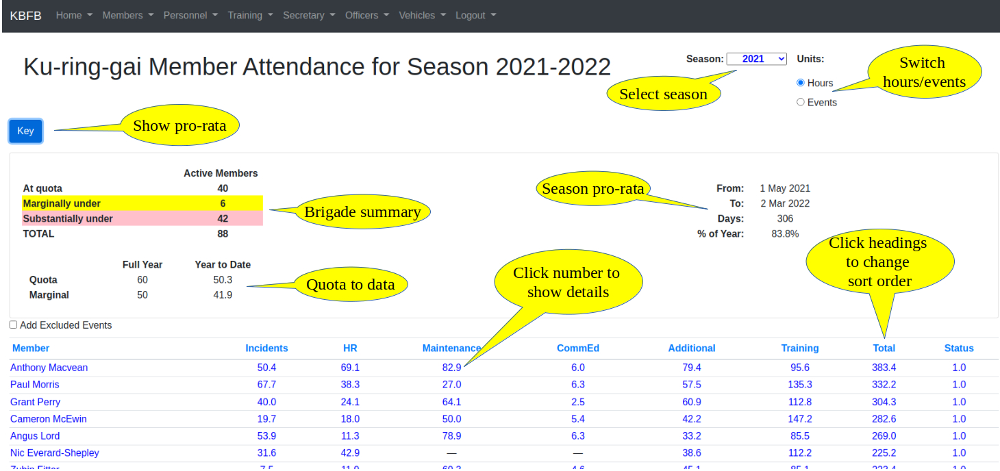

# Sign-in Server (Under construction)

The entire system is a web application, which runs on a server in the cloud (in our case, this is a server in a 
data centre run by Amazon Web Services in Sydney).

All interactions with the system, including from the Kiosk (which runs in a web browser), are made through this 
web application. The Kiosk is the "shop front" of the system, and is used most frequently by most users day-to-day, and is covered in an
{ref}`earlier section<eventsection>`.

Brigade members can also access the web application directly, using their phone, tablet, or PC, as long as it has 
an internet connection and a browser available. This section describes the services available on the Sign-in server.

## Logging In

```{margin} Multiple Tenants
The system architecture is what is known as [*multi-tenated*](multi-tenant-tech "*multi-tenanted*"). This allows 
the same server to support multiple brigades, with each being a distinct "tenant".
```

The sign-in server can be reached at <https://brigade.rsftag.com/bfb>. Note that you need to substitute the word 
**brigade** in this url with the actual name of your brigade (eg. westleigh).

You will be challenged to provide a username and password before you can login to the system.

By default, your username is the same as the email address that you use to communicate with your brigade. 

The first time you login, your default password will be the same as your RFS member number - you will then be asked to 
change this password before proceeding.

If you ever need to change your password (eg. if you forget it), you can change it by clicking on the *Lost password?* 
link on the login page. The system will then email you a link, and then you can change your password.

## Landing/home page

When you have logged in the system will take you to the brigade home page, an example of which is shown below:

:::{figure-md} home-page
:class: myclass


Home/landing page on server (click to enlarge)
:::

Navigation bar 
: Used to access most functions. The {ref}`Menu of Services<menu>` section below describes each of these in detail.

Membership Summary
: Shows the total number of active members broken down by their skills set. 
  
  It also shows, in red, the number of members currently on duty, ie. currently signed in at the station 
  (but not yet signed out). These figures are updated live, whenever anyone signs in or out at the station.

Upcoming events
: Shows details of future events in the calendar, including the number of members who have indicated 
  that they will be attending. Further details are available by clicking on the event Details. Members can indicate 
  their intention to attend these events in the Brigade Calendar (see below)
  
Shortcuts 
: The "At Station" shortcut shows a read-only replica of the Kiosk screen, and you can also access the
  *Brigade Calendar*. Both of these are also available under the Members menu in the Navigation bar.


(menu)=
## Menu of Services

### Members

#### Member List

For internal use only, members have access to a summary of basic contact details of all active members through the
Member List menu item, an excerpt of which is shown below. This can be printed to PDF format from your browser 
if a hard-copy is required.

```{Warning} Member Privacy:

If members do not wish their contact details to be shared with other members they can instruct the 
Personnel/Membership Officer to remove those details from this list. 

Also, this list is for Brigade use only, and should not be shared outside the Brigade.

```

:::{figure-md} memb-list
:class: myclass


Member List (excerpt) (click to enlarge)
:::

**Notes**

* Members only appear once on this list, in the first section they fit in to. It has the following sections:
  * **Field Officers**
  * **Crew Leaders** (CL, but not currently Field Officers)
  * **Tanker Drivers** (Neither Field Officers or Crew Leaders)
  * **Drivers** (None of above, but personnel vehicle qualified)
  * **Members** (None of the above)

Qualifications
: This shows any qualification in the following areas (expired qualifications shown in *lower case*):
* Driving
  * **TD** - Tanker driver (including current RFD)
  * **PD** - Personnel/light vehicle driver  (including current RFD)
* First Aid (**FAA**, etc.)
* Safe Working on Roofs - **SWR**
* Chainsaw Operator - (**TFT**, **TFI**, etc.)
* Village Firefighter - **VF**
* Highest qualification - Group Leader (**GL**), Crew Leader (**CL**), Advanced Firefighter (**AF**), Basic Firefighter (**BF**)

Rank
: This shows Field Officer positions in order of rank. All other members are shown as FF (Firefighter).

RfsID
: This is the RFS Membership number issued by the RFS.

#### Member Activity

The Member Activity menu item shows a summary of all activity in a fire season, in the form of a table with one row
for each active member. The member activity is broken down into major categories such as Training, 
HR, Maintenance, etc.

:::{figure-md} act-top
:class: myclass



Member Activity (top section) (click to enlarge)
:::

<p style="text-align: center">---/\/\/\/\/\---</p>

The Season (top right, above) is normally the current season, but records for previous years can be viewed 
by selecting an earlier season if historical data is available.

The numbers in the table can represent either Hours - the total time contributed by the member, or Events - the number 
of activities attended, and can switched with the control in the top right of the page.

##### Sorting

The table is initially sorted in ascending alphabetical order of Member name, but the sort order may be changed 
by clicking any of the table headings. For the numeric columns, the default order is descending (high to low), but 
this can be reversed by clicking the heading once more. The example in {ref}`Member Activity (top section)<act-top>` 
is sorted by *Total*.

##### Activity Details

If you click on any of the numbers in the table, it will drill down to the underlying data, and show a complete 
listing of all the events attended in the chosen category.

:::{figure-md} act-detail
:class: myclass


Sample of Maintenance Activity for a Member (click to enlarge)
:::

##### Totals

Each row has a Total figure, and when clicked this will show activity in all categories, for the selected member. 
Similarly, the last row in the table has Totals for each category of activity, and these can be clicked to show 
a full listing of all member attendance for that type of activity.

##### Voting Criteria and Colouring

Many brigades define Voting Criteria to determine which members are eligible to vote in Brigade Elections. Normally 
these criteria specify a minimum number of hours in a season/year (or attendance at a minimum number of events),
that the member must complete to be eligible to vote.

The Member Activity table uses these criteria ({ref}`set by the administrator<set-vote-crit>` on behalf of the Executive), 
to identify members who have met the criteria and those who have not. Members coloured yellow, are just below 
the criteria, those coloured red are well below the criteria, and the others are above.

:::{figure-md} act-mid
:class: myclass


Member Activity sorted on Total (middle section) (click to enlarge)
:::

The criteria are normally specified for an entire year. Since the Member Activity report is available to all members 
throughout the year, rather than having all members shown as well below the criteria for the first part of the year, 
the table calculates progress on a pro-rata basis.

Details of the pro-rata calculation can be seen by clicking the 
Key button (top left) - see {ref}`Member Activity (top section)<act-top>`

In the {ref}`example above<act-mid>`, we are 306 days through the year (83.8%), and the annual 
quota is 60 hours, so the pro-rata quota is 60 x 83% = 50.3 hours.

Anyone with a Total of more than 50.3 hours is coloured white, just less than that is coloured yellow, 
and further down, red.

#### At Station

The At Station item shows a replica of the Kiosk, including all events and members attending. 

:::{figure-md} dashboard
:class: myclass


At Station (click to enlarge)
:::

Unlike the Kiosk, you can not sign-in with this view, nor can you change any details.

This view is live, and is updated automatically whenever there is any activity on the Kiosk, 
including sign-in/out or new events created.

#### Events Calendar

A calendar view is provided so members can see all activities in the past, and also the future.

The view can be adjusted to show months, weeks, or days as required. Move forward or backward in time 
using the arrows in the top right.


##### Viewing Events

You can view the details of any event in the calendar just by clicking on it. 

In general you will see a view like this - read only, but with all the details.

If you are logged in as the OIC of the event, you will be able to modify the settings, as in ...


##### Filtering Events

The view can be filtered using the Search function, so for example you can easily find all "Training" events, or 
those attended by a particular member (just search for their surname).

##### Adding New Events (Officers)

The calendar can also be used by Officers to add new events planned for future dates.

##### Registering for Future Events (All Members)

plus cancelling registration


Well organised brigade has a calendar of upcoming events
Ideally members can indicate their intention to attend
OIC can see who to expect
See what’s happened and what’s coming up
View by day/week/month
Click on event for details
Can indicate that will be attending (may be useful for call out)
Can also drop out
Officers can create new events here
Members can only look, or nominate to attend

### Training

#### Courses Available

#### Quarterly Return

#### Driver Training (placeholder)

#### Training Materials (placeholder)

#### Training Calendar

### Secretary (placeholder)

### Officers

#### Add New Event (deprecated - see Calendar)

#### Review past events (deprecated - see Calendar)

#### Review Future Events (deprecated - see Calendar)

#### Officer Calendar

#### COVID-19 Attendance

#### Admin (deprecated)

### Vehicles

#### Update Vehicle Log

#### Update Vehicle Log Sheet

#### Vehicle Movements

#### Driver Activity

#### Vehicle Bookings

#### User Docs