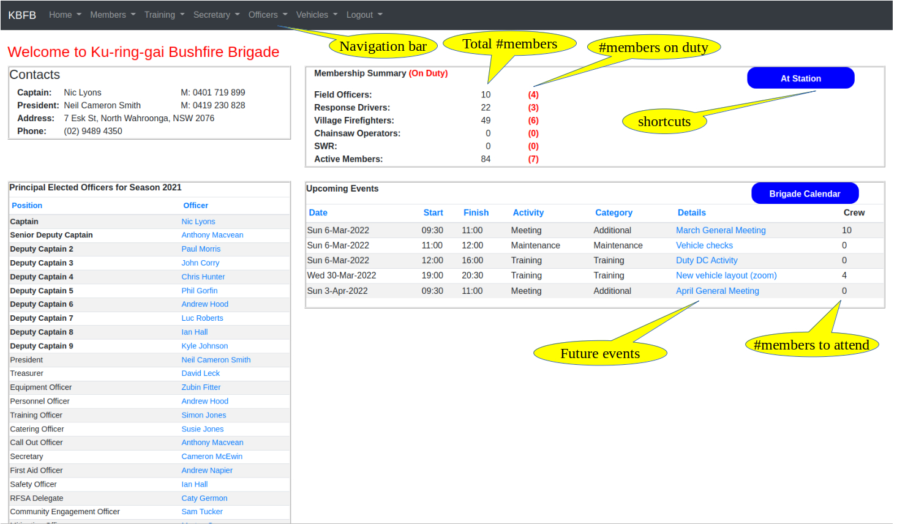

(serverh)=
# Web Portal

The entire system is a web application, which runs on a server in the cloud (in our case, this is a server in a 
data centre run by Amazon Web Services in Sydney).

All interactions with the system, including from the Kiosk (which runs in a web browser), are made through this 
web application. The Kiosk is the "shopfront" of the system, and is used most frequently by most users day-to-day, and is covered in an
{ref}`earlier section<eventsection>`.

Brigade members can also access the web application directly, using their phone, tablet, or PC, as long as it has 
an internet connection and a browser available. This section describes the services available on the web portal.

(logging_in)=
## Logging In

```{margin} Separate Domains
The same server supports {ref}`multiple brigades<multi-tenant-tech>`, so you need to say which one you require.
```

The web portal can be reached at <https://brigade.rfstag.com/bfb>. Note that you need to substitute the word 
<span style="color:blue;">brigade</span> in this url with the actual name of your brigade (e.g. westleigh).

You will be challenged to provide a username and password before you can login to the system.

By default, your username is the same as the email address that you use to communicate with your brigade. 

The first time you login, your default password will be the same as your RFS member number - you will then be asked to 
change this password before proceeding.

If you ever need to change your password (e.g. if you forget it), you can change it by clicking on the *Lost password?* 
link on the login page. The system will then email you a link, and you can change your password.

```{admonition} We know who you are...
:class: tip
Unlike the Kiosk, which is a shared device, and the system doesn't know who is operating it at any given moment, when you 
log into the server you use your own personal identifier (usually your email address), so the system knows who you are.

It also knows if you are an Officer (and what type), or not, based on records held in the system database.

The system uses this knowledge to control access to certain functions. Officers can do a little bit more than 
ordinary members (eg. they can create new events), and specialist Officers, eg. Training, have access 
to specific areas.
```

## Landing/home page

When you have logged in, the system will take you to the brigade home page, an example of which is shown below:

:::{figure-md} home-page
:class: myclass



Home/landing page on the web portal (click to enlarge)
:::

Navigation bar 
: Used to access most functions. The {ref}`Menu<menu>` section below describes each of these in detail.

Membership Summary
: Shows the total number of active members broken down by their skill sets. 
  
  It also shows, in <span style="color:red;">**red**</span>, the number of members currently on duty, 
  i.e. currently signed in at the station (but not yet signed out). These figures are updated live, 
  whenever anyone signs in or out at the station.

Upcoming events
: Shows details of future events in the calendar, including the number of members who have indicated 
  that they will be attending. Further details are available by clicking on the event Details. Members can indicate 
  their intention to attend these events in the {ref}`Brigade Calendar<calendar>`.
  
Shortcuts 
: The {ref}`At Station<at-stat>` shortcut shows a read-only replica of the Kiosk screen, and you can also 
  access the {ref}`Brigade Calendar<calendar>`. Both of these are also available under the Member menu 
  in the Navigation bar.


## Home Menu

### Executive Team

This shows a list of current Officers, both Field  and Administrative.

### Create Problem Report

This allows you to create a new problem ticket if you see any problems with the system. You can also use it to provide 
feedback or suggestions (these will be much appreciated).

### List Problem Reports

This shows a list of all tickets raised by your brigade.

### User Guide

Points to this User Guide. You'll need to find your own way back, as it's an external site.

(menu)=
## Member Menu

(memb-list-section)=
### Member List

Members have access to a summary of basic contact details of all active members through the
Member List menu item, an excerpt of which is shown below. This can be printed to PDF format from your browser 
if a hard-copy is required.

```{admonition} Member Privacy
:class: caution

If members do not wish their contact details to be shared with other members they can instruct the 
Personnel/Membership Officer to remove those details from this list. 

Also, this list is for Brigade use only, and should not be shared outside the Brigade.

```

:::{figure-md} memb-list
:class: myclass


Member List (excerpt) (click to enlarge)
:::

**Notes**

* Members only appear once on this list, in the first section they fit in to. It has the following sections:
  * **Field Officers**
  * **Crew Leaders** (CL, but not currently Field Officers)
  * **Tanker Drivers** (Neither Field Officers nor Crew Leaders)
  * **Drivers** (None of above, but personnel vehicle qualified)
  * **Members** (None of the above)

```{margin} Member Qualifications
   A more detailed view of Member Qualifications is also available - see {ref}`here<memb-quals>` 
```

(memb-list-quals)=
Qualifications
: This shows any qualification in the following areas (expired qualifications shown in *lower case*):
* Driving
  * **TD** - Tanker driver (including current RFD)
  * **PD** - Personnel/light vehicle driver  (including current RFD)
* First Aid (**FAA**, etc.)
* Safe Working on Roofs - **SWR**
* Chainsaw Operator - (**TFT**, **TFI**, etc.)
* Village Firefighter - **VF**
* Highest qualification - Group Leader (**GL**), Crew Leader (**CL**), Advanced Firefighter (**AF**), Basic Firefighter (**BF**)

Rank
: This shows Field Officer positions in order of rank. All other members are shown as FF (Firefighter).

RfsID
: This is the RFS Membership number issued by the RFS.

(memb-act)=
### Member Activity

The Member Activity menu item shows a summary of all activity in a fire season, in the form of a table with one row
for each active member. The member activity is broken down into major categories such as Training, 
HR, Maintenance, etc.

:::{figure-md} act-top
:class: myclass


Member Activity (top section) (click to enlarge)
:::

<p style="text-align: center">---/\/\/\/\/\---</p>

The Season (top right, above) is normally the current season, but records for previous years can be viewed 
by selecting an earlier season if historical data is available.

The numbers in the table can represent either **Hours** - the total time contributed by the member, 
or **Events** - the number of activities attended, and these can be switched using the control in the top 
right of the page.

#### Sorting

The table is initially sorted in ascending alphabetical order of Member name, but the sort order may be changed 
by clicking any of the table headings. For the numeric columns, the default order is descending (high to low), but 
this can be reversed by clicking the heading once more. The example in {ref}`Member Activity (top section)<act-top>` 
is sorted by *Total*.

#### Activity Details

If you click on any of the numbers in the table, it will drill down to the underlying data, and show a complete 
listing of all the events attended in the chosen category.

:::{figure-md} act-detail
:class: myclass


Sample of Maintenance Activity for a Member (click to enlarge)
:::

#### Totals

Each row has a **Total** figure, and when clicked this will show activity in all categories, for the selected member. 

Similarly, the last row in the table has Totals for each category of activity, and these can be clicked to show 
a full listing of all member attendance for that type of activity.

#### Voting Criteria and Colouring

Many brigades define Voting Criteria to determine which members are eligible to vote in Brigade Elections. Normally 
these criteria specify a minimum number of hours in a season/year (or attendance at a minimum number of events),
that the member must complete to be eligible to vote.

The Member Activity table uses these criteria ({ref}`set by the administrator<set-vote-crit>` on behalf of the Executive), 
to identify members who have met the criteria and those who have not. Members 
coloured yellow, are just below 
the criteria, those coloured red, are well below the criteria, and the others are above.

:::{figure-md} act-mid
:class: myclass


Member Activity sorted on Total (middle section) (click to enlarge)
:::

The criteria are normally specified for an entire year. Since the Member Activity report is available to all members 
throughout the year, rather than having all members shown as well below the criteria for the first part of the year, 
the table calculates progress on a pro-rata basis.

Details of the pro-rata calculation can be seen by clicking the 
<span class="badge badge-pill badge-primary">**Key**</span> button (top left) - 
see {ref}`Member Activity (top section)<act-top>`

<!--
In the {ref}`example above<act-mid>`, we are 306 days through the year (83.8%), and the annual 
quota is 60 hours, so the pro-rata quota is 60 x 83% = 50.3 hours.

Anyone with a Total of more than 50.3 hours is coloured white, just less than that is coloured yellow, 
and further down, red.
-->

(memb-quals)=
### Member Qualifications

Member qualifications are managed by the RFS, and are stored on their SAP server. The Sign-In system uses 
member qualifications in various areas, including the {ref}`Member List<memb-list-quals>` and in events, so that 
users can see the qualification status of members.

Training Officers can download qualifications for their Brigade into an excel file, and this can now be {ref}`uploaded 
to the Sign-In system<sync-sap>` so that it accurately reflects the current qualifications held by members in this Brigade. 
There is no need to maintain parallel records of qualifications, as the system will use those imported from the 
SAP listing.

The Member Qualification view shows a more detailed view of all member qualifications, including the following:

- Qualification status of all members in the major categories such as Firefighting, First Aid, Chainsaw, etc.
- The highest level of qualification attained by each member in the various categories.
- Total number of members qualified in each area.
- Drill down to show all qualifications for a member, or all brigade qualifications in a category.

:::{figure-md} brig-certs
:class: myclass


Member Qualifications View (click to enlarge)
:::

```{margin} Qualification Acronymns
   The acronyms used to represent particular qualifications are defined in 
   the [RFS Qualifications document](https://www.rfs.nsw.gov.au/__data/assets/pdf_file/0014/9032/6.1.2-Qualifications-for-NSW-RFS-Members.pdf).
```

Qualifications come in two main types:

**1. Perpetual**
   
   These are awarded after successful completion of training, and usually an examination. They are awarded for life,
   and never expire. If a member has attained a perpetual qualification, a <span style="background-color:lightgreen;">Y</span> 
   is shown against their name for this qualification.
  
**2. Renewable**
   
   These also require training, and usually an examination, but the qualification must be renewed periodically - 
   normally after 12 or 36 months - or it will expire. The table shows the highest qualification 
   attained by a member in these categories. If it is coloured Green, the qualification is current, and has not expired. 
   
   If the member doesn't have any current qualifications in a category, but does have expired ones, it will show the
   highest expired qualification in Red. Expired qualifications are not included in the count at the foot of each column.


(memb-skills)=
### Member Skills Currency

Some districts require brigades to actively assess and refresh the basic fire-fighting skills of their members on a 
regular basis, and this is generally done before the start of a new fire season.

The district may provide guidelines and checklists for specific skill sets that should be checked, but it is up to the
local brigades to ensure that these checks are done, and that records are kept by the brigade to show what checks 
have been completed.

My home district - Hornsby/Ku-ring-gai - recently introduced a Local Standard Operation Procedure (LSOP) **6.4.1 MEMBER 
SKILLS MAINTENANCE**, which specifies the checks to be done, and the form to be used to record the results of these checks.

I have added a new function to RFStag which wil hopefully make it easy to run these checks, and to record the results.

#### Member Skills Table

This table has a row for each brigade member, and a column for each skill to be checked. If the member has successfully 
passed a check of these skills, the date of the check is recorded in the table. If the cell is blank, no check has yet 
been completed.

:::{figure-md} user_brigade_skills
:class: myclass


Brigade Skills Table(click to enlarge)
:::

In the case of Village or Crew Leader checks, these will be marked "n/a" if the member is not qualified to that level, 
so the check is not applicable.

There are currently 5 groups of checks to be recorded (these are subject to change):

1. All Members (Safety, Radio, Overrun, Teams)
2. Firefighters (Draft, Tools, Fires, Hoses, Pumps)
3. Basic First Aid (optional)
4. Village Skills
5. Crew leader Skills


#### Assessors

Normally, the current set of Field Officers are authorised to perform skill checks on members, including other Field 
Officers. Note that no Assessor is permitted to check themselves.

If required, other members who are not currently Field Officers, can be added (by the brigade administrator) to the 
User Group **Assessors**, and they will then have permission to run skills checks on members in the same way as 
Field Officers (see below).

#### Assessment

Assessors will see the word **Check** in the Skills table when a skills check has not yet been completed. 

:::{figure-md} assess_brigade_skills
:class: myclass


Assessor Brigade Skills Table(click to enlarge)
:::


If they click on **Check**, a checklist will appear which shows the specific checks to be tested. 

:::{figure-md} skill-checks
:class: myclass


Skills Checklist (click to enlarge)
:::

These are just bullet points, and full details of the checks can be found in the appropriate SOP.

When the Assessor is satisfied that the member has demonstrated the requisite skill, they can click the **Pass** button, 
and details of the check will be recorded. The date of the successful check will be added to the table, and the name 
of the Assessor is also recorded.

The Assessor can also click on the Member's name (leftmost column), and they will see the status of all skills for that 
member. They can also run a check on a skills set by clicking **Check**.

:::{figure-md} member-skill-checks
:class: myclass


Member Skills (click to enlarge)
:::


(brigact-summ)=
### Brigade Activity Summary

The **Brigade Activity Summary** item shows a summary of brigade activities over a defined period.

The listing shows the number of events and total member hours for each category of events held during 
the specified period, as well as totals for each.

The default period ends on the current day, and starts 90 days earlier. The start and end dates for the 
required period can be changed by clicking on the dates in the top right of the page and selecting new 
start/end dates.

:::{figure-md} brigact-summary
:class: myclass


Brigade Activity Summary (click to enlarge)
:::

To view the events in each Category, click the category name, and this will show a listing of all individual events 
of that category that were held in the specified period.


(brigact-log)=
### Brigade Activity Log

The **Brigade Activity Log** item shows a listing of brigade events over a defined period.

Events are shown in ascending date order, starting from the date specified as the start of the reporting Period.

The order of events can be changed by clicking any of the table headings.

Further details, such as sign-in/out times for individual members can be viewed by clicking on the event description 
on the far right. 

By default, this list shows all events. The Brigade Activity Summary can be used to list only events of a specified 
Category if required.

The default period ends on the current day, and starts 90 days earlier. The start and end dates for the 
required period can be changed by clicking on the dates in the top right of the page and selecting new 
start/end dates.

:::{figure-md} brigact-log-pic
:class: myclass


Brigade Activity Log (click to enlarge)
:::

(at-stat)=
### At Station

The **At Station** item shows a replica of the Kiosk, including all events and members attending.

If, for any reason, the station needs to be evacuated, this page can be accessed on a phone to see who was 
in the building at the time.

:::{figure-md} dashboard
:class: myclass


At Station (click to enlarge)
:::

Unlike the Kiosk, you can not sign-in with this view, nor can you change any details.

This view is live, and is updated automatically whenever there is any activity on the Kiosk, 
including sign-in/out or new events created.

(calendar)=
### Events Calendar

A calendar view is provided so members can see all brigade activities in the past, and also the future.

:::{figure-md} cal-month
:class: myclass


Calendar Month View (click to enlarge)
:::

**Notes**:

* The calendar view can be adjusted to show a <span class="badge badge-pill badge-primary">**day**</span>, 
  <span class="badge badge-pill badge-primary">**week**</span>, 
  or <span class="badge badge-pill badge-primary">**month**</span>,
  as required. Move forward or backward in time using the arrows in the top right.

* Events are {ref}`colour coded<colour-coding>` by Activity type in the same way as on the Kiosk.

* The view can be filtered using the Search function (top right of the page), so for example you can easily find 
  all "Training" events, or those attended by a particular member (just search for their surname).


#### Viewing Event Details

You can view the details of any event in the calendar just by clicking on it. 

In general, you will see a view like this:

:::{figure-md} ev-read-view
:class: myclass


Event read-only view (click to enlarge)
:::

Note that all the fields are grey, which means you can't change anything. However, if you were logged in as the OIC of 
this event, you would be able to update the details as shown earlier {ref}`for the Kiosk<event-update>`.

#### Week View

Click the <span class="badge badge-pill badge-primary">**week**</span> button at the top of the page to go to the Week view:

:::{figure-md} call-week-a
:class: myclass


Calendar Week View (click to enlarge)
:::

(cal-add-event)=
#### Adding New Events (Officers)

If you are logged in as an Officer, you can create a new event in the calendar by selecting the area representing the 
times your activity will run (shown in blue above). You will then be asked to provide the details of the event. You can 
only create new events in the future like this, to protect the integrity of the attendance record.

```{admonition} Creating Events in Advance
:class: tip
As a courtesy to members, Officers should create events in advance, so that members don't have to do it
for them if they arrive at the station before the OIC. 

Apart from {ref}`pager callouts<pagercalls>`, most brigade activities such as Strike Teams, Training, Meetings, 
Maintenance etc. are planned in advance, and events {ref}`need to be created for them anyway<need-event>`. 
It's better not to leave this to the very last moment (at the kiosk), but instead set them up in advance so members 
can see what activities are coming up in the brigade calendar. 
```

#### Plan to Attend

Members can indicate their intention to attend future events using the calendar. 

This allows Officers to get expected numbers for their planned activities, and to see who is interested 
in attending, without needing to exchange a lot of emails.

In the Week view shown above:

* Each event from today onwards includes a symbol in the top right of the event. If the symbol shows
  <span class="fas fa-user-plus" style="color:brown; font-size:20px;"></span>, you 
  are not on the list of prospective attendees, but if you click this symbol it will indicate that you intend
  to join the activity, and your name will be added to the list. 
  
* If the symbol shows as <span class="fas fa-user-times" style="color:brown; font-size:20px;"></span>, 
  you are already on the list of prospective attendees, but if you change your mind, click the symbol, and you 
  will be removed (the symbol will change back 
  to <span class="fas fa-user-plus" style="color:brown; font-size:20px;"></span>)
  
* Past events show a tick mark <span class="fas fa-user-check" style="color:brown; font-size:20px;"></span> in 
  the top right if you have attended them. Past events can not be changed on the calendar.
  
You can always click in the centre of the event itself to {ref}`see all the details<ev-read-view>`, 
and confirm that you are on the list.

(off-signoff)=
#### Signing Off on an Event (Officers)

According to the original Attendance Book, Officers are required to check the attendance records for any activity 
they run, and once corrected and checked, sign it off, and cross out the page so that it can't be changed again.

In the sign-in system, this can be done by opening the calendar and finding the event you (the OIC) have run, 
and clicking on it.

You will then be able to check the attendance records, making any corrections as needed. You should then click 
the box marked "Checked" to sign it off.

:::{figure-md} offcheck
:class: myclass


Officer Checking their Event (click to enlarge)
:::

Once an event has been completed, only the OIC can update the details.


## Personnel Menu

```{margin} Restricted Access
Only the Personnel/Membership Officer and their assistants have access to this Menu.
```


### Change Officers

Most brigades hold elections every year, and new Officers are elected by members.

This item allows the Personnel Officer to update the list of Officers of the brigade. If the current date is before 
the end of the season, it just shows the current list of Officer positions, with the members who hold those positions. 
Small changes can be made in case of retirement or departures as needed.

If the date is after the end of the season, and no Officers have yet been saved for the new season, the system will 
also show a button that allows you to **"Copy Officers to new season"**. If you click this button, the system 
will create new Officer records for all positions in the new season using the same names as the previous season. 
You can then edit this list by changing the names of the officers to match the election results, then Save to 
update the system.

(add-memb)=
### Add New Member

This allows details of a new member to be recorded in the system. An RFS membership number is required.

(annual-att)=
### Annual Attendance

Some districts require hard-copies of attendance records to be sent to HQ for storage each year, similar to the old
Attendance Books.

This item will produce a listing of all attendance in a calendar year in a format similar to the old Attendance Book, 
which can be printed either to PDF or to paper by your browser as required, and then sent on to HQ.


## Training Menu

```{margin} Restricted Access
Only the Training Officer and their assistants have access to this Menu.
```

### Courses Available

This shows a list of Courses available in the brigade calendar.

### Quarterly Return

Some districts require brigades to submit a summary of all Training activities undertaken each querter. This report 
provides a list of all TRAINING events, with brief details of each activity.

:::{figure-md} train-qtr
:class: myclass


Training Quarterly Return (click to enlarge)
:::

### Training Calendar

This is just a filtered version of the Brigade Event calendar, showing only events of type TRAINING. 
It operates in exactly the same way as {ref}`Brigade Event calendar<calendar>`


## Officers Menu

```{margin} Restricted Access
Only current Office bearers, either Field Officers or Administrative Officers, have access to this Menu.
```

### Add New Event

This is an alternative way for Officers to create a new event (it's probably easier 
to {ref}`use the Brigade Calendar<cal-add-event>`). A blank event form {ref}`as used in the Kiosk<event-update>` 
is displayed. Fill in the details to add a new event.

### Review Past Events

This a legacy feature to show past events run by this Officer. It is superseded by the {ref}`Brigade Calendar<calendar>`. 
Just search for your surname with the calendar, and you will see all events - past and future - that you have 
been involved with.

### Review Future Events

This a legacy feature to show future events run by this Officer. It is superseded by the {ref}`Brigade Calendar<calendar>`. 
Just search for your surname with the calendar, and you will see all events - past and future - that you have 
been involved with.

### Officer Calendar

This is just a filtered version of the Brigade Event calendar, showing only events where the 
OIC is the member who is logged in. It operates in exactly the same way as {ref}`Brigade Event calendar<calendar>`

### COVID-19 Attendance

This report was produced to assist in contact tracing during the COVID-19 pandemic. It shows details of all members who 
attended the station during the past 21 days. Unless another pandemic or similar requires this, it will be withdrawn 
in the near future.

### Admin (deprecated)

All Officers have access to the special administration section of the application, though some have more 
access than others.

There are very few features in the admin section that can not be done in the main section, so access to this area will 
probably be restricted further to genuine system administrators in the near future.

## Vehicles Menu

An optional feature of the system is to record and maintain records of vehicle movements. It is intended to replace
the paper logbook records used in most RFS vehicles.

As well as recording details of vehicles movements, this feature also provides reports and summaries of vehicles use, 
as well as driving records for members.

(vehlogs)=
### Update Vehicle Log

This records the information journey taken in a brigade vehicle which was normally written in the log book.

When selected, this will ask you to choose which vehicle you want to add a record for, then it will show the 
following form:

:::{figure-md} vehlog
:class: myclass


Vehicle Log (single journey) (click to enlarge)
:::

The vehicle which you selected earlier is fixed, as is the initial odometer reading (taken from prior records). 

### Update Vehicle Log Sheet

This item allows bulk input of journeys, and can be used to transcribe a log sheet into the system.

It has one line for each journey, with the same content as the {ref}`Vehicle Log<vehlogs>`.

### Vehicle Movements

This shows a summary of vehicle movements in a form similar to the {ref}`Member Activity table<memb-act>`.

:::{figure-md} veh-mov
:class: myclass


Vehicle Movements (click to enlarge)
:::

Each vehicle is listed, and it's use in various types of activity is shown. Clicking on the numbers will show a 
full listing of movements for that vehicles in the required category.

Statistics for Hours, Kilometers, or number of Trips can be selected using the control at the top right of the page.

### Driver Activity

This shows a summary of driver journeys in a form similar to the {ref}`Member Activity table<memb-act>`.

:::{figure-md} drvmov
:class: myclass


Driver Journeys (click to enlarge)
:::

Each brigade driver is listed, and their participation in various types of activity is shown. Clicking on the 
numbers will show a full listing of journeys for this driver in the required category.

Statistics for Hours, Kilometers, or number of Trips can be selected using the control at the top right of the page.

(vehbook)=
### Vehicle Bookings

This shows a calendar with all events where a vehicle has been reserved as part of an event - 
see {ref}`Event Fields<ev-veh>`. It can be useful to see what vehicles are committed, and when, to avoid any clashes.

:::{figure-md} vehcal
:class: myclass


Vehicle Bookings (click to enlarge)
:::

It shows all vehicle bookings, but can be filtered using Search (top right) to restrict the events shown.
